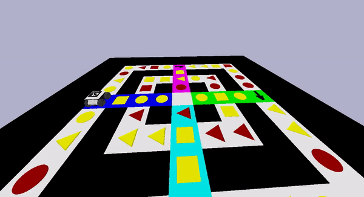
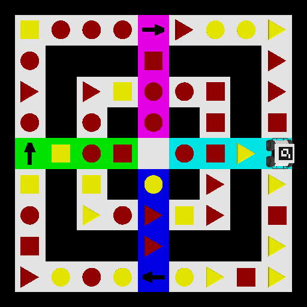
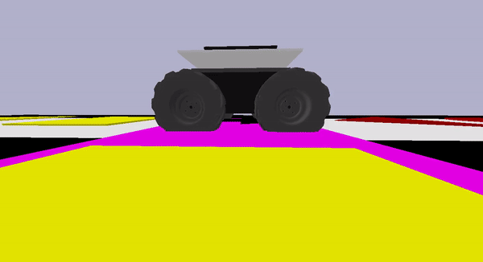

<h3>Table of Contents</h3>
<ul>
    <li><a href="#introduction">Introduction</a></li>
    <li><a href="#implementation">Approach</a></li>
    <li><a href="#installation-and-setup">Installation and Setup</a></li>
    <li><a href="#usage">Simulation</a></li>
    <li><a href="#team">Team</a></li>
</ul>

<h3 id="introduction">Introduction</h3>

   
   
    

<ul>
   <li>
      The Arena is divided into two paths: <strong>INNER Square</strong> and <strong>OUTER Square</strong>. These paths are interconnected by four distinct pathways, each marked with a unique color and leading to the Home Zone at center.
   </li>
   <li>
      The Bot can switch between the <strong>OUTER</strong> and <strong>INNER paths</strong> and is mandated to move in clockwise direction.
   </li>
   <li>
      Various shapes (<strong>Square</strong>, <strong>Circle</strong>, and <strong>Triangle</strong>) adorn the Arena, each represented in two distinct colors, <strong>Red</strong> and <strong>Yellow</strong>, creating a total of six unique combinations as illustrated in the following figure.
   </li>
    
   <table align="center">
      <td align="center">
         
          
         
         <b>TR : Red Triangle</b>
         
          
      </td>
      <td align="center">
         
          
         
         <b>SR : Red Square</b>
         
          
      </td>
      <td align="center">
         
          
         
         <b>CR : Red Circle</b>
         
          
      </td>
      <td align="center">
         
          
         
         <b>CY : Yellow Circle</b>
         
          
      </td>
      <td align="center">
         
          
         
         <b>SY : Yellow Square</b>
         
          
      </td>
      <td align="center">
         
          
         
         <b>TY : Yellow Triangle</b>
         
          
      </td>
   </table>
   <li>
      Positioned at the OUTER squares of the Arena are four <strong>Black Arrows</strong>, indicating the <strong>Starting Zone</strong> for the bot.
   </li>
   <li>
      At the commencement of each turn, a function generates a shape-color combination. Afterwards, the bot is tasked with navigating to the nearest block that matches the specified criteria from its current position. 
   </li>
   <li>
      The heart of the Arena serves as the <strong>Home Zone</strong>. The Bot's objective is to navigate the Arena, completing a full clockwise circuit and returning to the Home Zone upon successful completion of the circuit.
   </li>
</ul>

<h3 id="implementation">Approach</h3>
<ul>
   <li>
      Leveraged the <b>OpenCV</b> library to implement <b>Computer Vision</b> techniques, including <b>Masking, Erosion, Dilation Thresholding and Contour Approximation</b>, ensuring precise Image Segmentation from the arena. It involves extracting and storing all shape-color combinations, including their respective center coordinates.
   </li>
   <li>
      Utilized a renowned physics engine <b>PyBullet</b>, to simulate the bot's movement within the Arena. Furthermore integrated <b>Aruco Markers</b> onto the bot for ensuring real-time tracking of its position in the arena.
   </li>
   <li>
      Used <b>Breadth First Search (BFS)</b> on a directed graph (where edges are created in the  direction of allowed movement) to secure all possible paths from the current position to the target destination (which is identifiable through output combination), selecting the route with the minimum length for traversal.
   </li>
   <li>
      Implemented a <b>Two Vectors Approach</b> to guide the bot's movement, one indicating bot heading direction and the other vector between successive grids the bot traverses. User-defined functions like <code>dist()</code> - <code>ang()</code> - <code>rotate()</code> and <code>move()</code> are leveraged for ensuring proper alignment and maneuvering the bot within arena.
   </li>
   <li>
      Altered graph edges after the bot crossed the starting zone to ensure the bot completes a clockwise round and does not retrace its previous path. The simulation concludes upon reaching central <b>home zone</b>.
   </li>
</ul>

<h3 id="installation-and-setup">Installation and Setup</h3>
<blockquote>
   It is recommended to set up a virtual environment to avoid conflicts between package versions installed on your system and keep your workspace organized. To create a virtual environment and activate it, please follow the instructions detailed on <a href="https://docs.python.org/3/library/venv.html">python venv page</a>. The procedure to deactivate environment is also given here.
</blockquote>
 
<blockquote>
   Before proceeding with installation, please install <a href="https://visualstudio.microsoft.com/visual-cpp-build-tools">Microsoft C++ Build Tools</a>. 
</blockquote>
 
<ul>
   <li>Clone the git repo using the following: <code>git clone https://github.com/asood-life/vision-2.0.git</code></li>
   <li>Install the required packages using <code>pip install -r requirements.txt</code></li>
   <li>Obtain additional environment dependencies using <code>pip install -e vision-arena</code></li>
</ul>

<h3 id="usage">Simulation</h3>
Execute <code>python vision.py</code> in command line to commence the simulation.

<h3 id="team">Team</h3>

    <table>
         <td align="center">
            <a href="https://github.com/Aadi1110">
               
                
               
                  <b>Aadi Shukla</b>
               
            </a>
             
         </td>
         <td align="center">
            <a href="https://github.com/asood-life">
               
                
               
                  <b>Akshat Sood</b>
               
            </a>
             
         </td>
      </table>

    Thank you for taking the time to go through this project! If you find it valuable, please consider giving it a ⭐ star. Your support is appreciated and helps others in discovering the project. Should you have enhancement requests or encounter a bug, please report it in the <a href="https://github.com/asood-life/vision-2.0/issues">Issues</a> section. Your feedback is crucial in improving this project.

